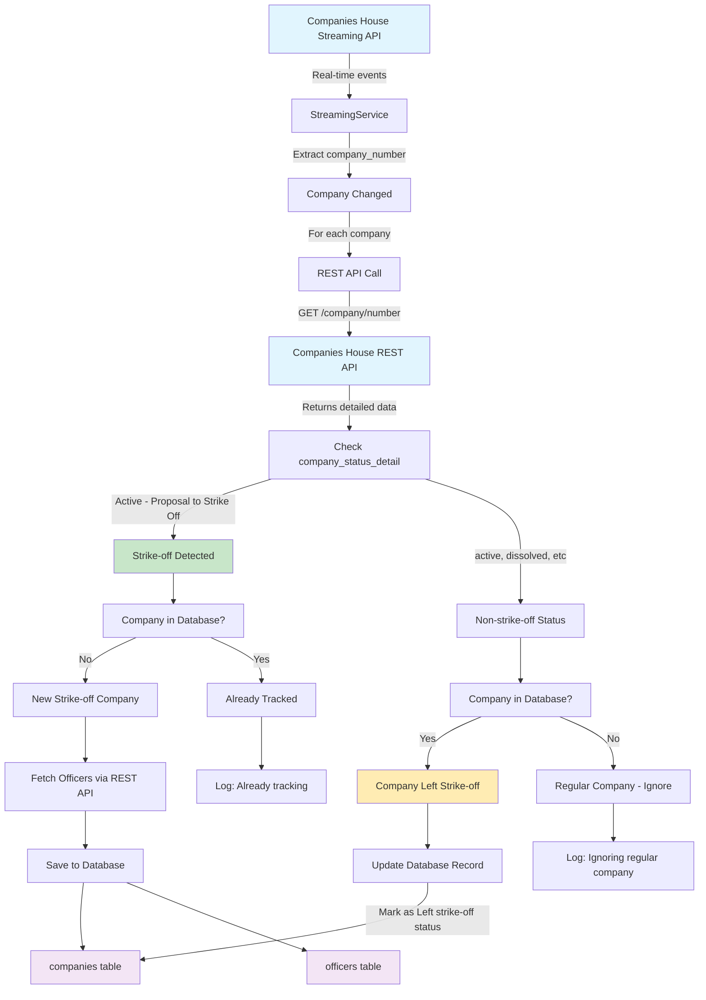

# Companies House Streaming Architecture

## Current Hybrid System Flow



## Data Flow Details

### 1. Streaming Detection
- **Input**: Real-time company profile changes
- **Limitation**: Only provides basic status ("active", "dissolved")
- **Purpose**: Real-time notification that something changed

### 2. REST API Enhancement
- **Trigger**: Every streaming event
- **Purpose**: Get detailed status including "Active - Proposal to Strike Off"
- **Rate Limit**: 600 requests per 5 minutes (same as bulk processing)

### 3. Decision Logic

#### New Strike-off Companies
```
IF detailed_status contains "proposal to strike off"
AND company NOT in database
THEN fetch officers and save everything
```

#### Companies Leaving Strike-off
```
IF detailed_status does NOT contain "proposal to strike off"
AND company IS in database
THEN mark as "Left strike-off status"
```

#### Regular Companies
```
IF company NOT in database
AND status is regular (active, dissolved, etc)
THEN ignore (just log at debug level)
```

## Current Components

| Component | Purpose | API Used |
|-----------|---------|----------|
| StreamingClient | Real-time change detection | Streaming API |
| REST API calls | Detailed status fetching | REST API |
| EventProcessor | Parse and route events | Both |
| Database | Store strike-off companies | SQLite |
| Officer Import | Fetch officers for new companies | REST API |

## Key Files Modified

- `streaming_service.py` - Main hybrid logic
- `src/streaming/event_processor.py` - Event parsing (still used)
- `src/streaming/client.py` - Streaming connection (still used)
- Tests need updating for new flow

## Rate Limiting Considerations

- **Streaming API**: Continuous connection, minimal rate limit impact
- **REST API**: 1 call per company change + officer fetching
- **Current limit**: 600 calls per 5 minutes
- **Typical load**: Depends on company change frequency

## Database Schema

```sql
-- companies table stores strike-off companies
CREATE TABLE companies (
    company_number TEXT PRIMARY KEY,
    company_name TEXT,
    company_status_detail TEXT,  -- "Active - Proposal to Strike Off"
    stream_last_updated TEXT     -- When we last processed this company
);

-- officers table stores officers for strike-off companies
CREATE TABLE officers (
    company_number TEXT,
    officer_role TEXT,
    name TEXT,
    -- ... other officer fields
);
```
